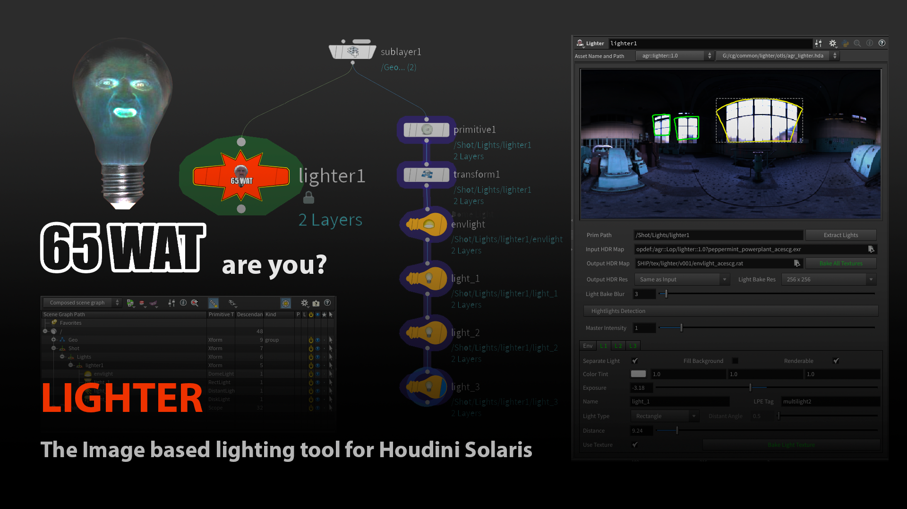
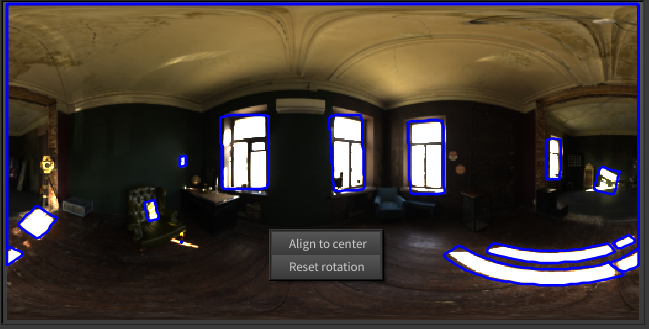
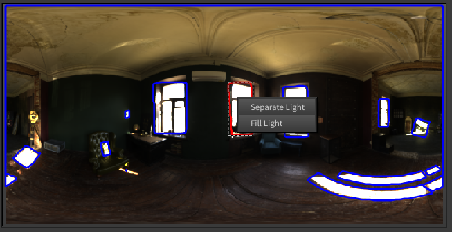
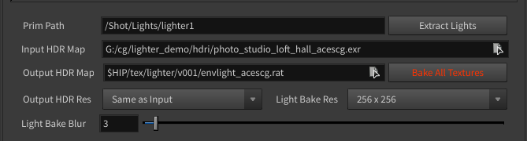
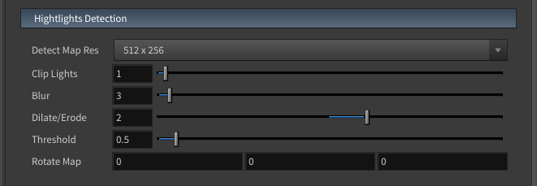
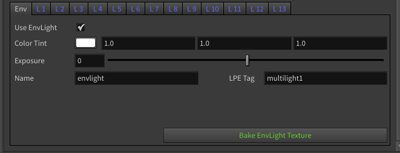
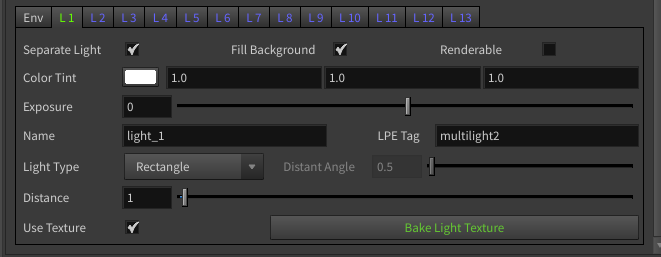

# Main features:
1. Change color and brightness of hdr map highlights.
2. Fill highlights with background.
3. Align image orientation.
4. Convert any highligt to separated light.

# Installation
Clone this repository, and add path to it in houdini.env file.

`HOUDINI_PATH = "path/to/cloned/lighter;&"`

# Image viewer

The viewer contains a preview of the lights. Here you can rotate the image, interact with individual highlights.
Each frame is the border of a bright area that can be edited or made a separate light source.
Areas that are part of the image are marked in blue, already separated lights in green.

# General settings

* Primpath - root xform primitive for new lights.
* Extract Lights - Convert lighter to set of native houdini lights.
* Input HDR Map - input texture
* Output HDR Map - path for baked environment map. Textures for individual lights will save near the environment.
* Bake All Textures - bake textures for environment map and all potentially detachable lights.
* Output HDR Res - resolution of output environment map. (Same as input, 1024x512, 2048x1024, 4096x2048)
* Light Bake Res - texture resolution for individual lights. (64x64, 128x128, 256x256, 512x512)
* Light Bake Blur - texture blur (more blur - less details and less noise)

# Highlight Detection

* Detect Map Res - resolution of analisis map (512x512, 1024x512, 2048x1024). It uses for build light bounds.
* Clip Lights - brightess more then this thresold will detect as highlights.
* Blur - blur analisis map if you want to average details.
* Dilate/Erode - expands and then narrows highlights. This parameter is needed to glue a lot of small spots.
* Threshold - threshold for converting highlights into a two-tone image for the trace. Pixels smaller than this value will be black.
* Rotate map - rotate hdr in polar space.

# Lights settings
* Master Intensity - intensity for environment light and all separated lights.

# Environment light

* Use EnvLight - create domelight.
* Color Tint - color multiplier.
* Exposure - exposure.
* Name - name of environment light primitive.
* LPE Tag - lpe tag.
* Bake EnvLight Texture - bake only environment map.

# Highlights

* Separate Light - create light fron this highlight
* Fill Background - delete highlight on environment map and fill it with background colors.
* Renderable - make light renderable in karma.
* Color Tint - color multiplier.
* Exposure - exposure.
* Name - name of separated light primitive.
* Lpe Tag - lpe Tag.
* Light Type - avalable types: Distant, Point, Sphere, Disc, Rectangle.
* Distante Angle - angle of spot for distance light. 
* Distance - distance between separated light an center. Use this parameter for setting position of light in 3d space. Size will changed automaticaly for save size as in hdr map.
* Use Texture - avalable only for Rectangle light type.
* Bake Light texture - Bake texture only for this highlight.

# Known issues and limitations that I plan to improve later.
* Text fields respond to mouse wheel when parameter not selected.
* When clicking on a text field, the value is not selected as in Houdini text fields.
* When you press enter key, while editing the value, it dive inside the lighter node.
* Light shapes multiselection not supported
